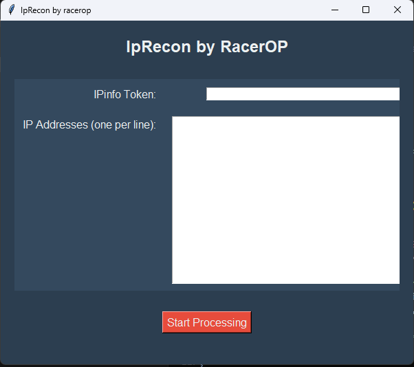

# IpRecon by RacerOp

IpRecon by racerop is a Tkinter-based GUI application designed to fetch detailed information about a list of IP addresses using the IPinfo API and save the results into a CSV file. This tool is particularly useful for cybersecurity professionals and researchers who need to analyze IP address data efficiently.

## Features

- Fetch detailed information about IP addresses including location, ISP, and organization details.
- Multithreading for faster processing of large lists of IP addresses.
- User-friendly GUI built with Tkinter.
- Save results to a CSV file.

## Prerequisites

Before you begin, ensure you have met the following requirements:

- Python 3.x installed on your machine.
- Required Python libraries installed:
  - `requests`
  - `tkinter`
  - `concurrent.futures`

You can install the required libraries using pip:

```bash
pip install requests
```

## Getting Started

To get a local copy up and running, follow these simple steps.

### Installation

1. Clone the repository:

```bash
git clone https://github.com/instax-dutta/IPRecon.git
cd IPRecon
```

2. Install the required Python libraries:

```bash
pip install requests
```

### Usage

1. Run the application:

```bash
python iprecon.py
```

2. Enter your IPinfo token in the "IPinfo Token" field.

3. Enter the IP addresses (one per line) in the "IP Addresses" text box.

4. Click the "Start Processing" button.

5. Choose the location to save the resulting CSV file.

6. The application will process the IP addresses and save the results in the specified CSV file. A message will appear once the processing is complete.

### Getting Your IPinfo API Token

To use this application, you need an IPinfo API token. Follow these steps to obtain your token:

1. Visit [IPinfo.io](https://ipinfo.io/).
2. Click on the "Get Access Token" button in the top right corner (or [sign up here](https://ipinfo.io/signup)).
3. Create an account or log in if you already have one.
4. After logging in, you will be directed to your dashboard.
5. Copy the token provided in the dashboard.

### Detailed Information

The application retrieves the following information for each IP address:

- IP Address
- Hostname
- City
- Region
- Country
- Latitude and Longitude
- Organization
- Postal Code
- Timezone
- ASN (Autonomous System Number)
- ASN Name
- ASN Domain
- ASN Route
- ASN Type
- Company Name
- Company Domain
- Company Type
- Privacy Details (VPN, Proxy, Tor, Relay, Hosting, Service)
- Abuse Contact Information (Address, Country, Email, Name, Network, Phone)

### Example

Here is a sample screenshot of the application:



## Contributing

Contributions are what make the open source community such an amazing place to learn, inspire, and create. Any contributions you make are **greatly appreciated**.

To contribute:

1. Fork the Project
2. Create your Feature Branch (`git checkout -b feature/AmazingFeature`)
3. Commit your Changes (`git commit -m 'Add some AmazingFeature'`)
4. Push to the Branch (`git push origin feature/AmazingFeature`)
5. Open a Pull Request

## License

Distributed under the MIT License. See `LICENSE` for more information.